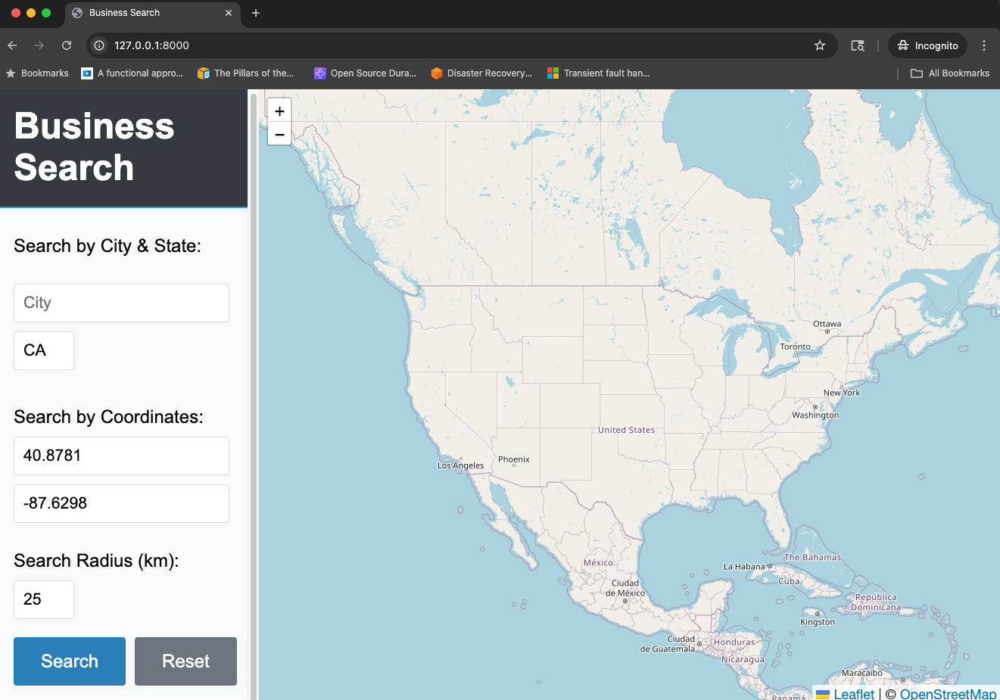
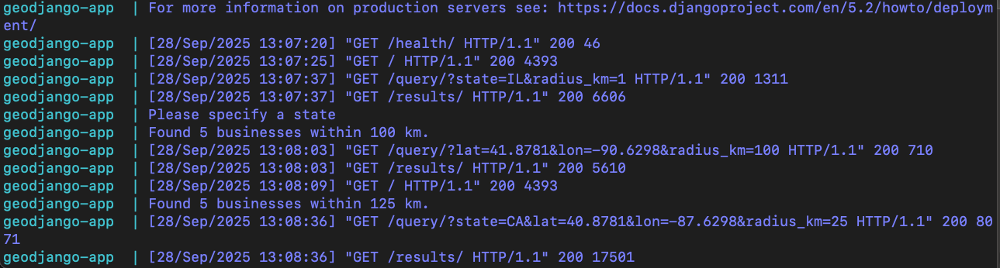

# Business Locator app using GeoDjango and SpatiaLite

A proof-of-concept application demonstrating geospatial functionality with Django and SpatiaLite. This application allows users to search for businesses based on location and displays them on an interactive map.

## Features

- **Interactive Map**: Visualize business locations using OpenStreetMap and Leaflet.js
- **Spatial Search**: Find businesses within a specified radius of a location
- **Health Check**: Built-in health check endpoint for monitoring
- **Docker Support**: Easy setup and deployment using Docker
- **Local Development**: Alternative to Docker, set up with Homebrew and uv for local development

## Prerequisites

- Python 3.8+
- Docker and Docker Compose (for containerized setup)
- Homebrew (alternative local development setup)

## Quick Start

1. Clone the repository:
   ```bash
   git clone git@github.com:g4mp3a/geodjango-poc.git
   cd geodjango-poc
   ```

2. Choose your setup method:

### Option 1: Docker (Recommended)
#### Using docker
```commandline
docker build -t geodjango-app .
docker run -p 8000:8000 geodjango-app
```
#### Using docker-compose
```bash
# Build and start the application
docker-compose up --build
```

### Option 2: Local Development Setup
`uv` for local development.
```bash
# Install dependencies using Homebrew
brew install django spatialite-tools gdal

# Install Python dependencies using uv
uv sync

# Run migrations
uv run manage.py migrate

# Load sample data
uv run manage.py load_businesses [--clear]

# Start the development server
uv run manage.py runserver
```
Alternatively, can use pip as well.
```bash
# Install dependencies using Homebrew
brew install django spatialite-tools gdal

# Create and activate virtual environment
python -m venv venv
source venv/bin/activate

# Install Python dependencies using pip
pip install -r requirements.txt
Note: You can also re-generate the requirements.txt file using either 
- `uv pip compile pyproject.toml [uv.lock] -o requirements.txt`
- `uv export --format requirements-txt > requirements.txt `
- Any other preferred method that you like

# Run migrations
python manage.py migrate

# Load sample data
python manage.py load_businesses [--clear]

# Start the development server
python manage.py runserver
```

3. Access the application at http://localhost:8000


Reset to search for businesses again.

4. Console output:


## Project Structure

```
geodjango-poc/
├── biznezz/                 # Django project configuration
├── search/                  # Main application
│   ├── management/commands/ # Custom management commands
│   ├── migrations/          # Database migrations
│   ├── static/              # Static files (JS, CSS)
│   └── templates/           # HTML templates
├── .dockerignore
├── .gitignore
├── Dockerfile
├── docker-compose.yml
├── entrypoint.sh
├── manage.py
└── requirements.txt
```

## API Endpoints

- `GET /` - Main application interface
- `GET /health` - Health check endpoint
- `GET /query/` - Search businesses by location

## Environment Variables

- `DEBUG`: Django debug mode (default: True)
- `SPATIALITE_LIBRARY_PATH`: Path to SpatiaLite library
- `GDAL_LIBRARY_PATH`: Path to GDAL library
- `GEOS_LIBRARY_PATH`: Path to GEOS library

## License

